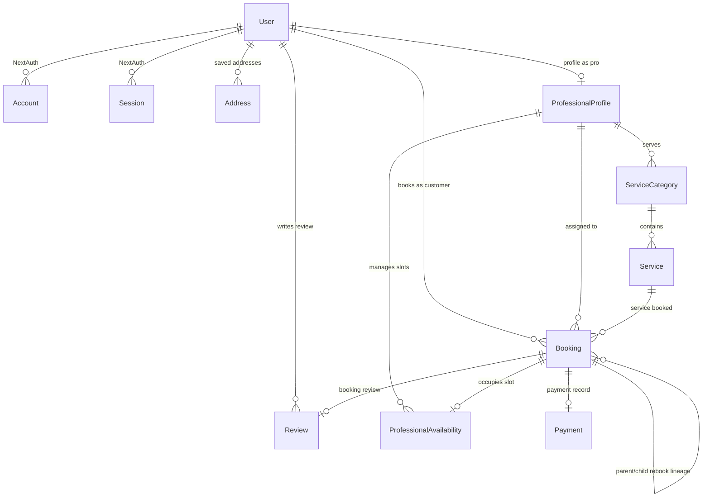

# Database Specification & Architecture: PostgreSQL + Prisma ORM
**Project:** Urban Company — One-Click Rebooking  
**Target Backend Dev:** [Sai Rishit Sunku](mailto:sairishit.sunku.s.112@kalvium.community)  
**Database Architect:** [Steve Antony Somavarapu](mailto:steveantony.somavarapu.s.112@kalvium.community)  
**PRD Reference:** [Urban Company rebook system PRD.md](../docs/Urban%20Company%20rebook%20system%20PRD.md)

---

## 1. Overview & Objectives

This document defines the production PostgreSQL database schema, data models, concurrency control mechanisms, and indexing strategies for the **One-Click Rebooking** system.

### Key Goals
1. **Zero-Latency Parallel Data Retrieval**: Efficient composite indexes to fetch user profile, previous booking history, and professional slot availability simultaneously ($\le 1\text{s}$ response time).
2. **Rebooking Lineage Tracking**: Support `parentBookingId` and `bookingSource` (`DIRECT` vs `REBOOK`) to maintain self-referential booking chains.
3. **Double-Booking & Conflict Prevention**: Atomic database transactions with slot status locks and optimistic locking version counters.
4. **Seamless Auth Integration**: 100% NextAuth / Auth.js v5 compatible user and session models.

---

## 2. Entity Relationship Diagram (ERD)



---

## 3. Data Models Breakdown

| Model | Purpose | Critical Fields |
| :--- | :--- | :--- |
| **`User`** | Customers, Service Pros, Admins | `role`, `email`, `phone`, `emailVerified` |
| **`Address`** | Customer delivery addresses | `userId`, `street`, `city`, `isDefault`, `isDeleted` |
| **`ServiceCategory`** | Top-level domains (Car Care, Home Cleaning) | `name`, `slug`, `iconUrl` |
| **`Service`** | Specific bookable service | `categoryId`, `name`, `basePrice`, `durationMinutes`, `isActive` |
| **`ProfessionalProfile`** | Professional stats & category linkage | `userId`, `categoryId`, `ratingAvg`, `ratingCount`, `isAvailable` |
| **`ProfessionalAvailability`**| Calendar slot availability | `professionalId`, `date`, `startTime`, `endTime`, `status` (`AVAILABLE`, `BOOKED`, `BLOCKED`), `version` |
| **`Booking`** | Core booking & rebooking entity | `customerId`, `professionalId`, `serviceId`, `addressId`, `slotId`, `status`, `bookingSource` (`DIRECT`/`REBOOK`), `parentBookingId` |
| **`Payment`** | Transaction settlement | `bookingId`, `amount`, `status`, `method`, `transactionId` |
| **`Review`** | Customer ratings post-service | `bookingId`, `customerId`, `professionalId`, `rating`, `comment` |

---

## 4. Prisma Schema Location

The full production schema is maintained at:
📄 [database/prisma/schema.prisma](prisma/schema.prisma)

### Key Indexes for Performance SLAs
- **Booking History ($\le 2\text{s}$ SLA)**: `@@index([customerId, status, createdAt(sort: Desc)])`
- **Professional Calendar ($\le 1\text{s}$ SLA)**: `@@index([professionalId, date, status])` and `@@index([professionalId, startTime, endTime, status])`
- **Fallback Alternatives**: `@@index([categoryId, isAvailable, ratingAvg])`

---

## 5. Concurrency & Rebooking Transaction Pattern

To satisfy PRD Risk Mitigation (Section 16) against double bookings during peak concurrent usage:

```typescript
import { PrismaClient, BookingStatus, BookingSource, SlotStatus } from '@prisma/client';

export async function executeOneClickRebook(prisma: PrismaClient, input: {
  customerId: string;
  professionalId: string;
  serviceId: string;
  addressId: string;
  slotId: string;
  parentBookingId: string;
  totalPrice: number;
}) {
  return await prisma.$transaction(async (tx) => {
    // 1. Atomically acquire slot
    const claim = await tx.professionalAvailability.updateMany({
      where: {
        id: input.slotId,
        status: SlotStatus.AVAILABLE, // Fails if status changed concurrently
      },
      data: {
        status: SlotStatus.BOOKED,
        version: { increment: 1 },
      },
    });

    if (claim.count !== 1) {
      throw new Error('SLOT_ALREADY_TAKEN');
    }

    const slot = await tx.professionalAvailability.findUniqueOrThrow({
      where: { id: input.slotId },
    });

    // 2. Create child rebooking linked to parent (using slotId as canonical relation)
    const booking = await tx.booking.create({
      data: {
        customerId: input.customerId,
        professionalId: input.professionalId,
        serviceId: input.serviceId,
        addressId: input.addressId,
        slotId: slot.id,
        bookingSource: BookingSource.REBOOK,
        parentBookingId: input.parentBookingId,
        totalPrice: input.totalPrice,
        scheduledDate: slot.date,
        scheduledStartTime: slot.startTime,
        scheduledEndTime: slot.endTime,
        status: BookingStatus.CONFIRMED,
      },
    });

    return booking;
  });
}
```

---

## 6. Developer Quickstart & Migration Commands

Navigate to the `database` folder:
```bash
cd database
```

### Step 1: Install Dependencies
```bash
npm install
```

### Step 2: Configure Environment
Copy `.env.example` to `.env` and set your PostgreSQL credentials:
```bash
cp .env.example .env
```

### Step 3: Run Database Migrations
```bash
npx prisma migrate dev --name init_urban_company_rebook
npx prisma generate
```

### Step 4: Seed Initial Test Data (Suresh & Teja Personas)
Run the seed command:
```bash
npm run db:seed
# or
npx prisma db seed
```

### Step 5: Open Prisma Studio (Database GUI)
```bash
npm run db:studio
# or
npx prisma studio
```
